# How to add custom helm patches and .wav samples to Quest Standalone version of VirtuosoVR 

1) Download [Quest Patcher](https://github.com/Lauriethefish/QuestPatcher/releases)   
   a) Follow the link and scroll down a little  
   b) Download a QuestPatcher-Windows-Standalone.zip or QuestPatcher-Windows.exe

   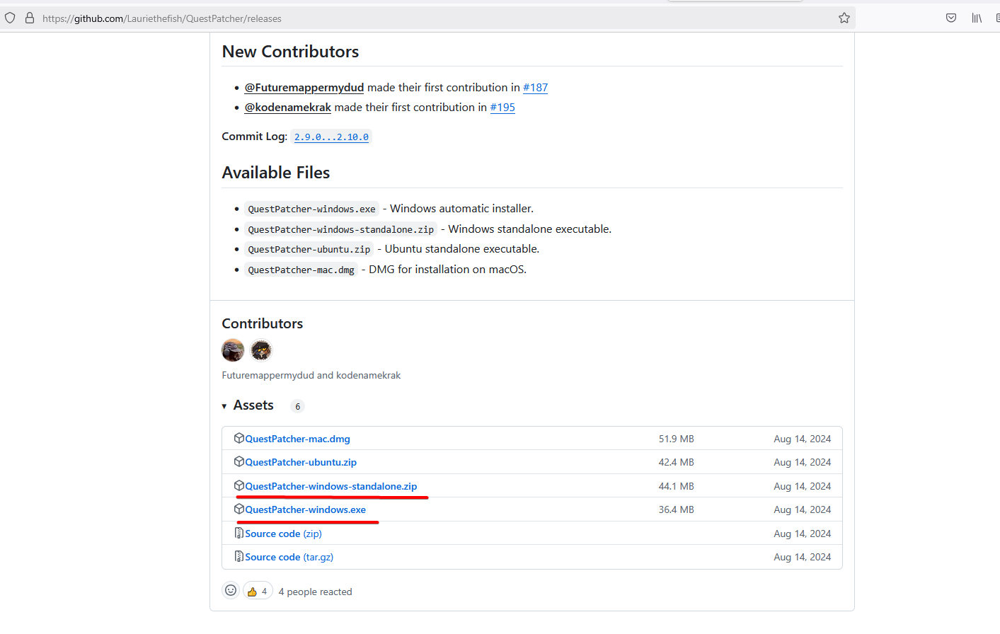

2) Unzip the archive or install the application on your machine  
     
3) Download the [CSPL Virtuoso Mod](https://github.com/v0idp/CSPLq/releases)  
   a) Download the csplq.qmod file from the latest release

   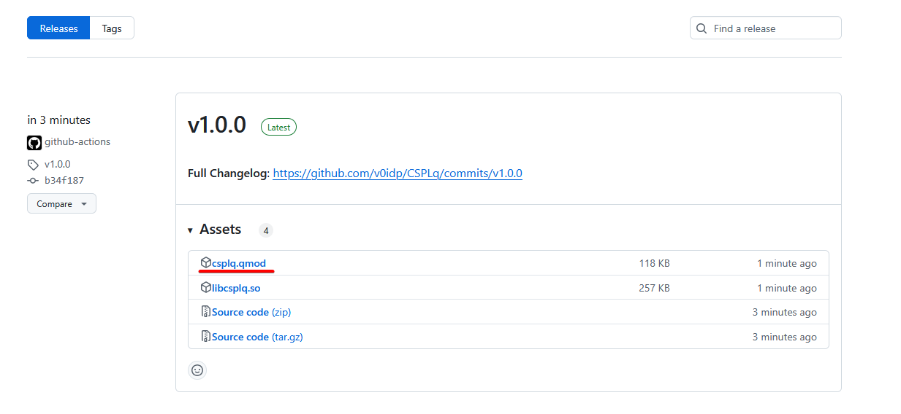

4) Enable developer mode on your Quest device. Guide for it can be found [here](https://help.arborxr.com/en/articles/6333136-developer-mode-on-meta-quest-devices) or you can watch [this video](https://www.youtube.com/watch?v=GqBTnn8Nr4k)

5) Connect your Quest Device to your PC and allow file access/debugging in your headset

6) Start the Quest Patcher application  
   a) Select “Tools and options” tab on the right and click “Change App” button under Options

   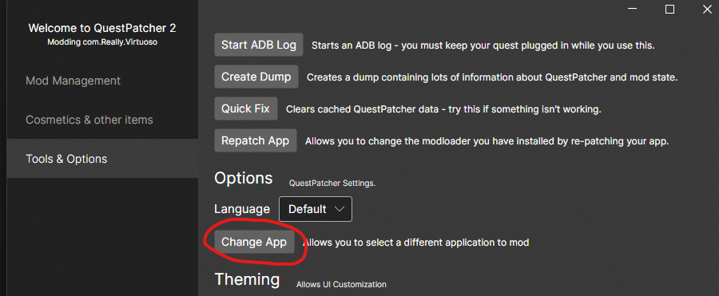
        
   b) Select “com.Really.Virtuoso” and click “Confirm New App”

   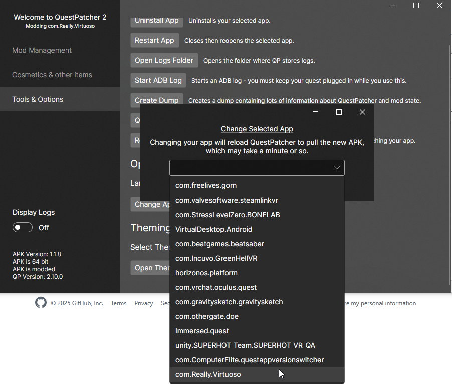

   c) If asked which library to use for patching select “scotland2"

   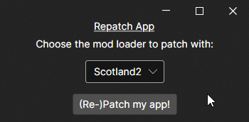

   d) Select “Mod Management” tab on the left and press “Browse” in the top right corner

   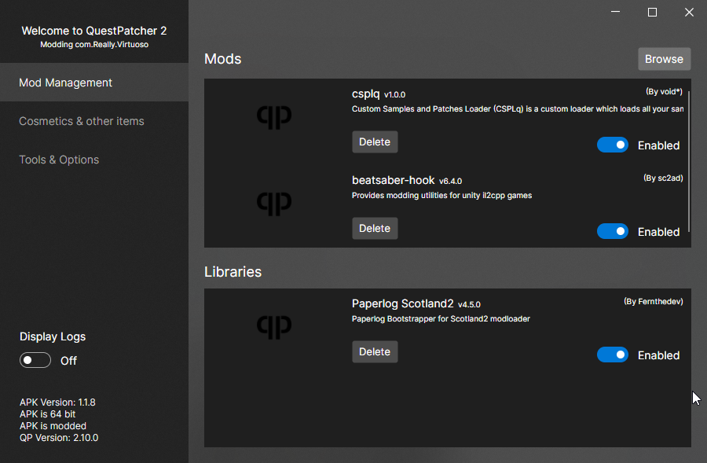
        
   e) Select the “csplq.qmod” file that you have downloaded in the step 3

   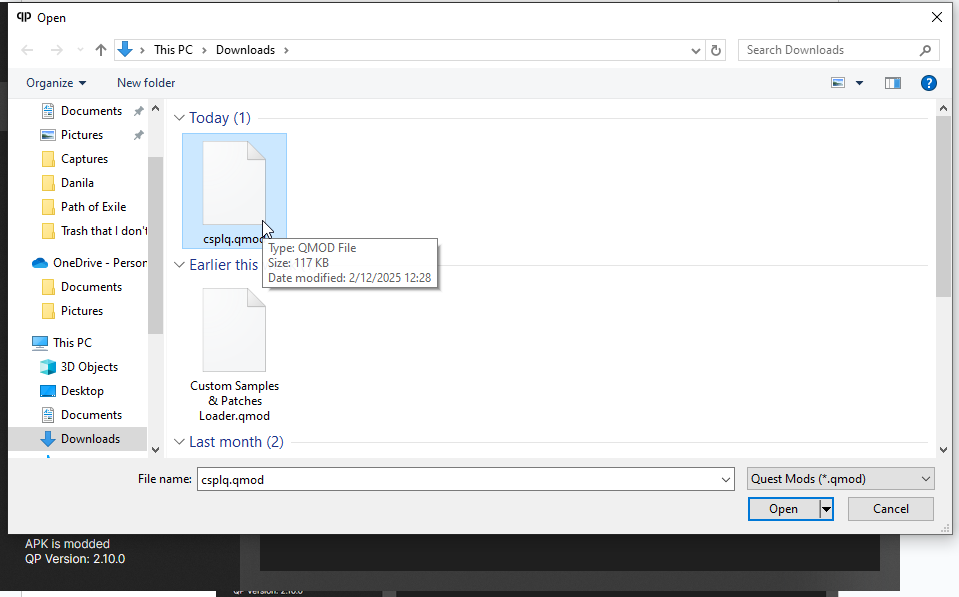

   f) Make sure all the mods and libraries are enabled!

   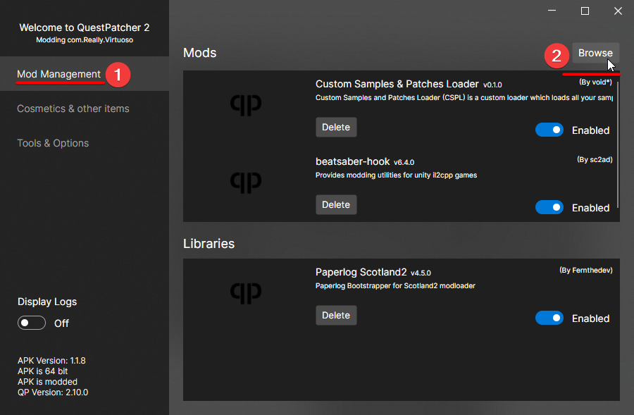

7) Open SideQuest or any file explorer for Quest devices of your choosing (If you don’t have it \- installation instructions can be found [here](https://sidequestvr.com/setup-howto))  
   a) Click “Manage Files” in the top right corner

   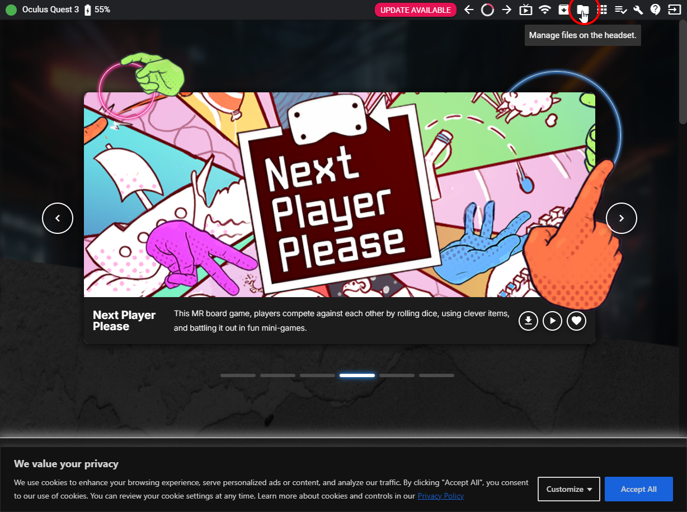

   b) Navigate to “\\ModData\\com.Really.Virtuoso\\”
   c) In the bottom right corner press on the big \+ button and then select “Make new folder”

   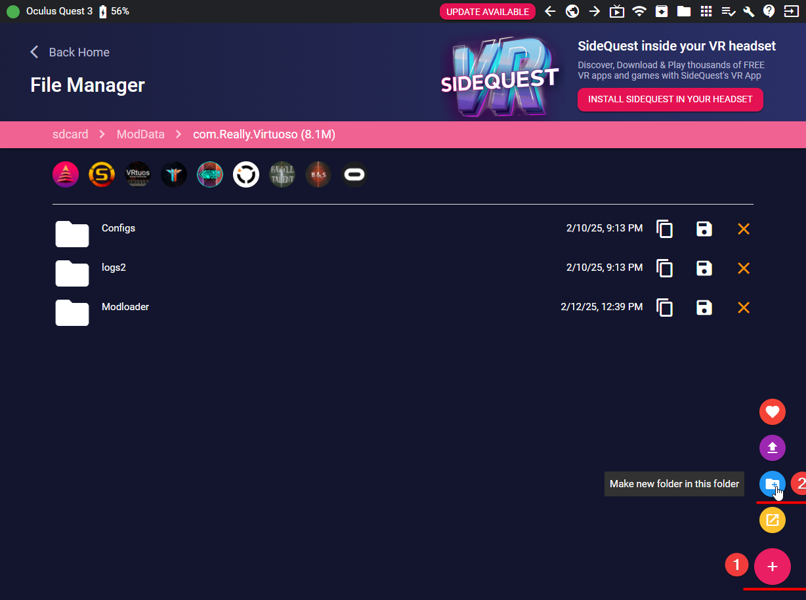

   d) Create a folder called “import” (Case sensitive\!)

   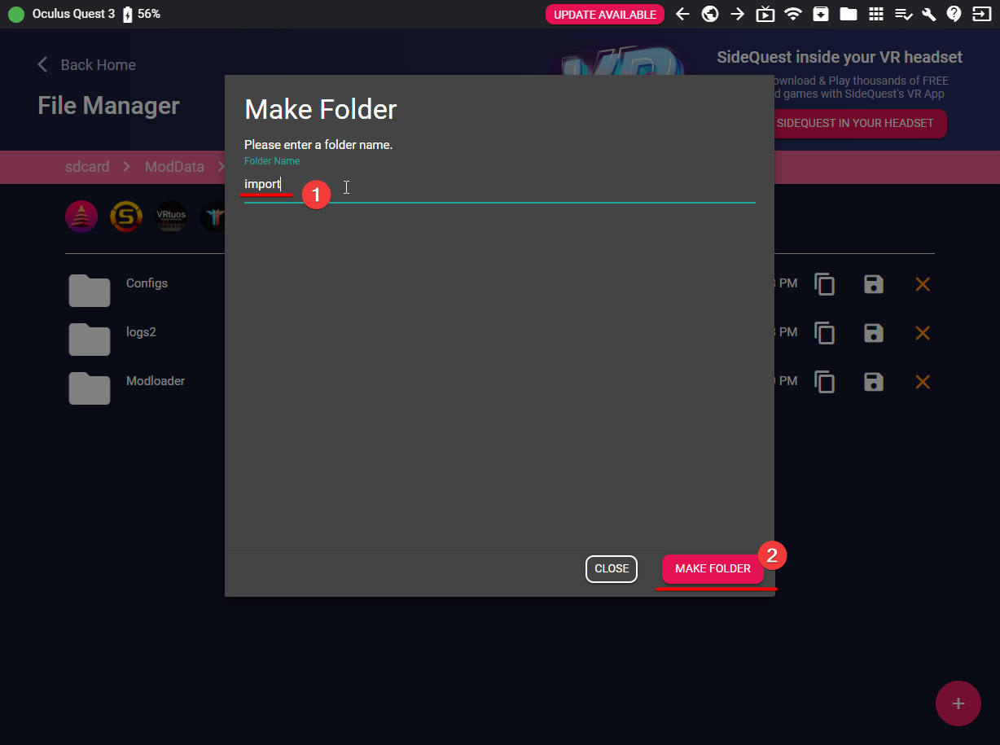

   e) Inside of “import” folder create two new folders called “patches” and “samples”  
   f) Drag your custom .helm patches into the “patches” folder  
   g) Inside “samples” folder create folders with the following names: “Bass Drums”, “Car Doors”, “Crashes”, “Effects”, “Hi-hats”, “Rides”, “Snares and Toms” (Case sensitive\!)  
   h) Place your .wav samples into one of the group folders.  

8) Open Virtuoso VR on your headset and grant access to files/microphone. If you are getting the “Restore App” popup when launching the game DO NOT PRESS RESTORE\! Press “Open App” instead.

9) Done\! Your .helm patches will appear in the Preset selection on the instruments and your .wav patches will appear on Empads in the corresponding group.
